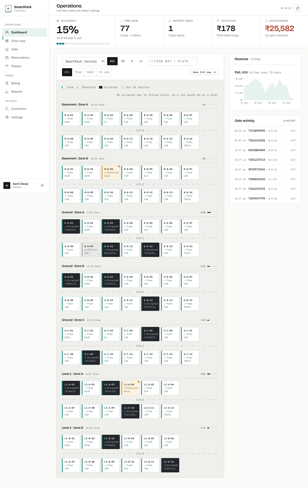
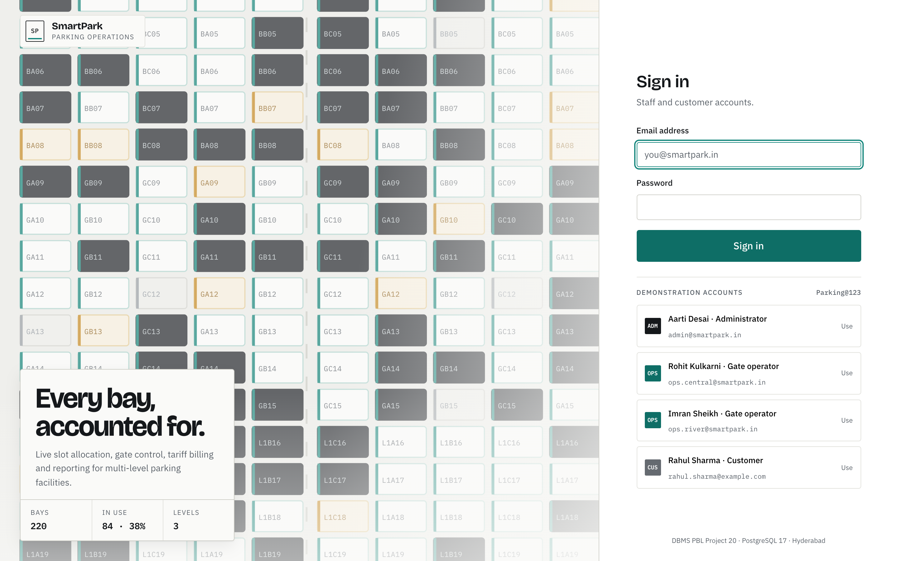
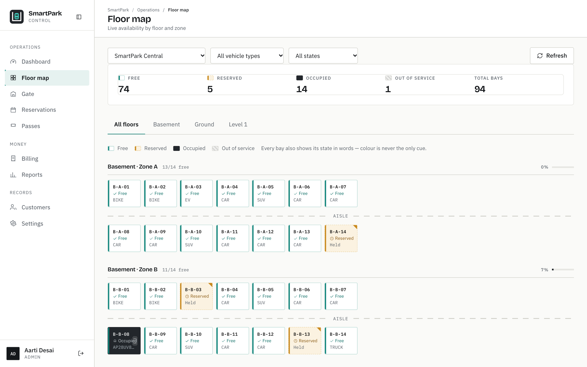
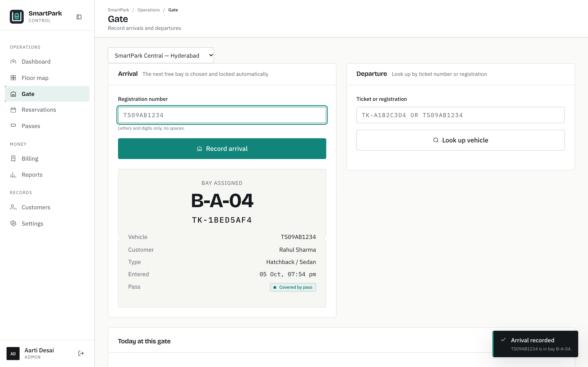
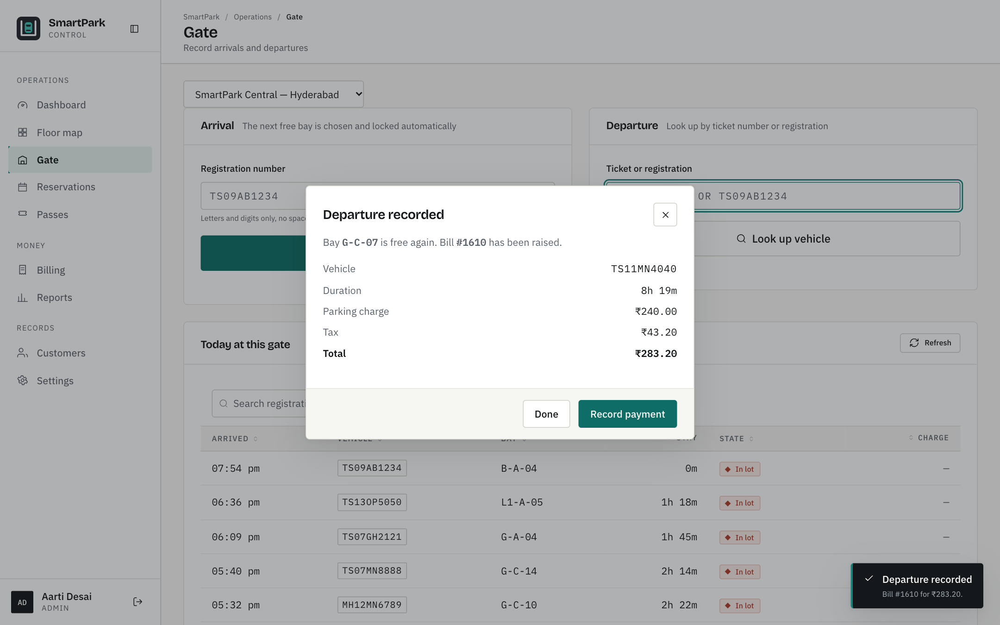
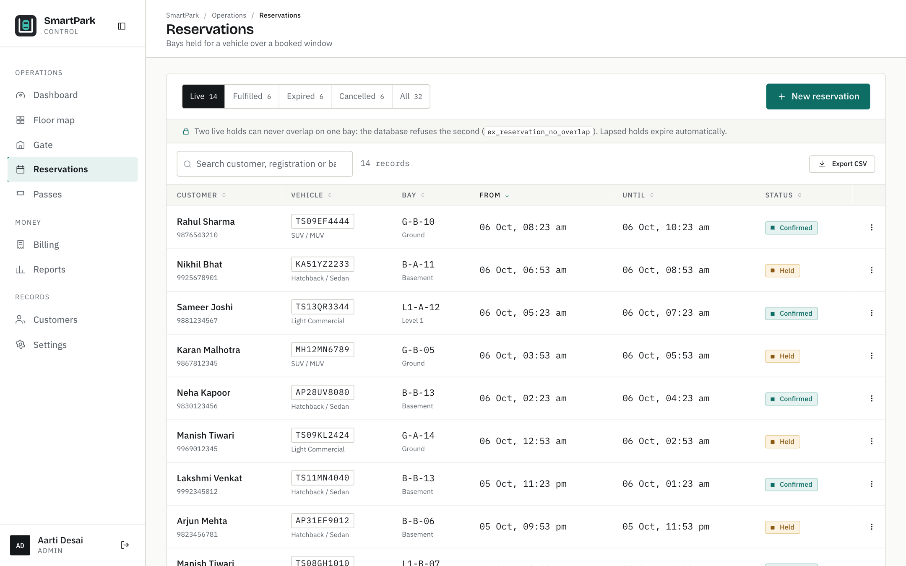
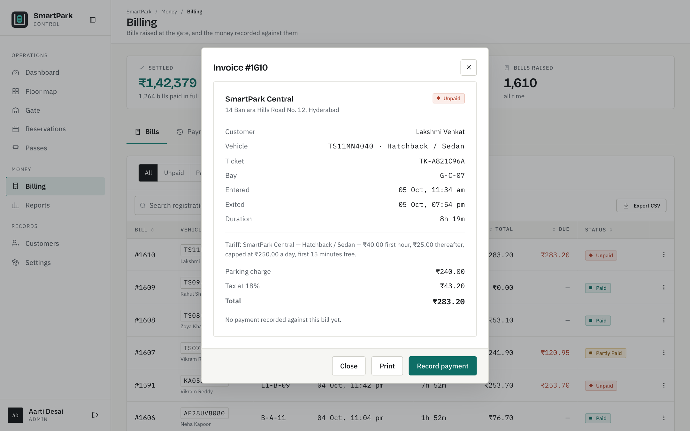
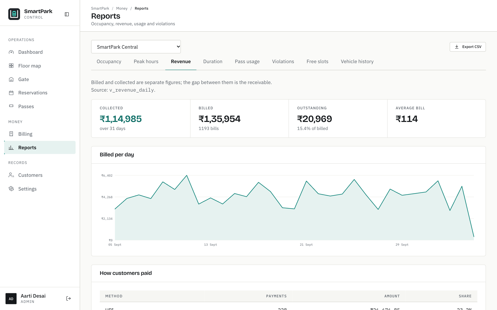
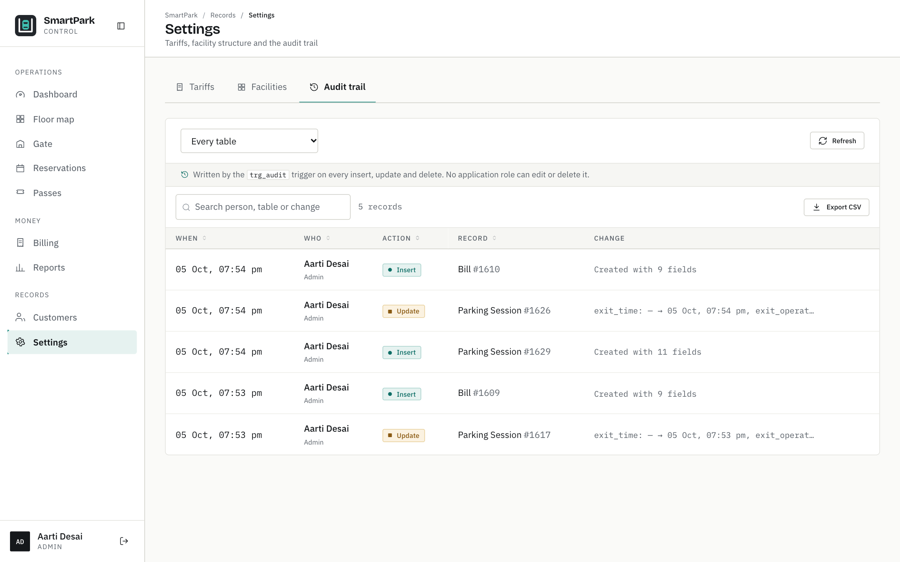

<p align="center"></p>

# SmartPark — Parking Lot Allocation & Billing System

**DBMS PBL Project 20** · PostgreSQL 17 · Python (FastAPI) · plain HTML/CSS/JS, no build step

A working operations system for multi-level parking: live slot allocation,
reservations, gate entry and exit, tariff-based billing, passes, payments,
violations and reporting. The database enforces the business rules; the
application only asks it to.

Live demo: **https://smartpark-green-two.vercel.app** (sign-in details below;
the hosted database is a free Supabase project and may take a few seconds to
wake).



---

## The problem

Multi-level parking facilities need live slot allocation, reservations,
entry/exit records, passes and billing. Manual ticketing produces two specific
failures:

- **Slot conflicts.** Two attendants hand out the same bay because neither can
  see what the other just did.
- **Revenue leakage.** Charges are computed by hand from a rate card, so they
  are inconsistent, and unpaid exits go unrecorded.

This system removes both at the database level rather than by asking staff to be
careful. Gate entry takes a row lock on the bay it is about to allocate, so two
operators cannot be handed the same one. Every charge is computed by a single
database function from the tariff that was in force when the vehicle arrived —
the application cannot supply an amount, and if it tries, a trigger overwrites
it.

## Objectives

1. Model facilities, floors, zones, slots, vehicle types, customers, vehicles,
   reservations, sessions, passes, tariffs, bills, payments and violations in a
   relational schema normalised to 3NF.
2. Enforce every business rule with keys, constraints, triggers and
   transactions, so invalid states cannot be stored whatever the client does.
3. Give administrators, gate operators and customers a working interface, each
   seeing only the rows they are entitled to (row-level security).
4. Report occupancy, revenue, peak hours, durations, pass usage, violations and
   free slots straight from database views.

## Features

| Screen | What it is for |
|---|---|
| **Dashboard** | Live occupancy, free bays, today's entries and takings, outstanding money, a 14-day revenue chart and a live activity feed |
| **Floor map** | The building as a floor plan — floors, zones, aisles, every bay's state. Click a bay for its details, or take it out of service with a reason |
| **Gate** | Record an arrival (bay chosen and locked automatically) and a departure (bill raised on exit) |
| **Reservations** | Hold a bay for a future arrival; overlapping holds and wrong-type bays are impossible; lapsed holds expire as no-shows |
| **Passes** | Sell and cancel daily, weekly and monthly passes; a pass makes its stays free |
| **Billing** | Bills, printable invoices, payments (never beyond the balance) and a payments ledger |
| **Reports** | Occupancy, peak hours, revenue, duration, pass usage, violations, free slots and per-vehicle history, each exportable to CSV |
| **Customers** | Customers and their vehicles: add, edit, remove (refused while history exists) |
| **Settings** | Tariff versions, facility structure and the audit trail (administrators only) |

Every list can be searched, sorted and exported; destructive actions ask for
confirmation; every action reports success or the database's reason for
refusing it in plain English. Keyboard shortcuts: press `?` in the app.

## Technology

| Layer | Choice | Why |
|---|---|---|
| Database | PostgreSQL 17 (local), Supabase in the hosted demo | Exclusion constraints, partial indexes, row-level security, PL/pgSQL |
| Application | Python 3.11, FastAPI, psycopg 3 (raw SQL, no ORM) | Every query is visible and explainable; the database does the work |
| Auth | bcrypt password hashes, signed JWT | Role and identity are passed to PostgreSQL per request for RLS |
| Interface | HTML, CSS and ES modules; Motion for animation; hand-drawn SVG charts | No build step; open a file, edit, refresh. Motion and the fonts are vendored in `web/vendor/` and `web/fonts/`, so the app runs fully offline |
| Tests | psql scripts, pytest, Playwright with the system Chrome | |

## Architecture

```
Browser (web/*.html + ES modules)
   │  fetch /api/...  with a Bearer token
   ▼
FastAPI (api/main.py)          one endpoint = one SQL statement or one function call
   │  per request:  BEGIN; SET LOCAL ROLE parking_<role>;
   │                SET LOCAL app.current_user_id = <id>;  ...  COMMIT
   ▼
PostgreSQL
   ├── tables + keys + CHECK / UNIQUE / EXCLUDE constraints   (what may be stored)
   ├── triggers                                               (derived values, audit)
   ├── functions: fn_gate_entry / fn_gate_exit / fn_calculate_charge …
   │                                                          (transactions with row locks)
   ├── row-level security policies                            (who sees which rows)
   └── views: v_current_occupancy, v_revenue_daily …          (the reports)
```

## Database at a glance

17 tables · 8 views · 16 PL/pgSQL functions · 14 triggers · 26 RLS policies on
9 tables · 59 indexes · 36 foreign keys · 33 CHECK, 17 UNIQUE and 3 EXCLUDE
constraints. Built by 18 numbered migrations in `db/migrations/`.

| Business rule | Enforced by |
|---|---|
| One vehicle per bay, one bay per vehicle, at a time | Partial unique indexes `uq_active_session_slot`, `uq_active_session_vehicle` |
| A car cannot use (or be booked into) a bike bay | Composite foreign keys on `(slot_id, vehicle_type_id)` and `(vehicle_id, vehicle_type_id)` |
| Exit must follow entry | `CHECK (exit_time > entry_time)` |
| No overlapping reservations, passes or tariffs | GiST `EXCLUDE` constraints |
| Charges come from the tariff | `fn_calculate_charge()` + a trigger that overwrites any client-supplied amount |
| No payment beyond what is owed | `trg_payment_within_balance` locks the bill and checks the balance |
| Bookings and passes only for your own vehicle | Composite FKs onto `vehicle (vehicle_id, customer_id)` |
| An occupied or booked bay cannot be taken out of service | `fn_set_slot_service()` with row locks |
| Every change is recorded | `trg_audit` on ten tables → `audit_log` (admin-read-only) |
| Who can see what | Row-level security per role, `security_invoker` views |

Two operators cannot be handed the same bay: `fn_gate_entry` locks it with
`SELECT … FOR UPDATE SKIP LOCKED` inside the transaction that inserts the
session.

---

# Getting it running

Written for someone comfortable with a browser but new to the command line.
Every command is meant to be copied whole and pasted into **Terminal**.

To open Terminal: press `Cmd + Space`, type `Terminal`, press Return.

## The short way

If PostgreSQL is already installed and running, these commands do
everything:

```bash
git clone https://github.com/EXCALIBUR303/smart-parking.git && cd smart-parking
```

```bash
./setup.sh
```

```bash
./.venv/bin/uvicorn api.main:app --port 8077
```

Then open **http://127.0.0.1:8077** and sign in as `admin@smartpark.in` with the
password `Parking@123`.

If that worked, skip to [Try it in two minutes](#try-it-in-two-minutes). If
anything failed, or you would rather see each step, carry on below — the long
way does exactly the same thing, one command at a time.

To rebuild the database from scratch later: `./setup.sh --reset`

---

## The long way, one step at a time

### Step 1 — check you have PostgreSQL and Python

Paste this and press Return:

```bash
psql --version && python3 --version
```

You should see two version lines, PostgreSQL 14 or newer and Python 3.11 or
newer. If `psql` is not found on a Mac, install it with:

```bash
brew install postgresql@17
```

and then add it to your path for this session:

```bash
export PATH="/opt/homebrew/opt/postgresql@17/bin:$PATH"
```

### Step 2 — start the database server

```bash
brew services start postgresql@17
```

Check it is listening:

```bash
pg_isready
```

You want to see `accepting connections`.

### Step 3 — get the project and go to its folder

```bash
git clone https://github.com/EXCALIBUR303/smart-parking.git && cd smart-parking
```

### Step 4 — create the database

```bash
createdb smartpark
```

Nothing is printed when this works. If it says the database already exists and
you want to start fresh, remove it first:

```bash
dropdb --if-exists smartpark && createdb smartpark
```

### Step 5 — build the schema and load the sample data

This runs all eighteen migration scripts in order: schema, functions,
views, indexes, security, then the sample data. It takes a few seconds.

```bash
for f in db/migrations/*.sql; do psql -q -v ON_ERROR_STOP=1 -d smartpark -f "$f" || break; done
```

Check it worked:

```bash
psql -d smartpark -c "SELECT count(*) AS slots FROM slot; SELECT count(*) AS sessions FROM parking_session;"
```

You should see about 134 slots and about 1,600 sessions.

### Step 6 — install the Python packages

This creates a private folder called `.venv` for this project's packages, so
nothing is installed system-wide.

```bash
python3 -m venv .venv && ./.venv/bin/pip install -r requirements.txt
```

### Step 7 — start the application

```bash
./.venv/bin/uvicorn api.main:app --port 8077
```

Leave this running. It prints `Application startup complete.`

### Step 8 — open it

Go to **http://127.0.0.1:8077** in your browser.

Sign in with any of these. The password for all of them is `Parking@123`.

| Role | Email | Sees |
|---|---|---|
| Administrator | `admin@smartpark.in` | Everything, both facilities, Settings |
| Gate operator | `ops.central@smartpark.in` | SmartPark Central only |
| Gate operator | `ops.river@smartpark.in` | SmartPark Riverside only |
| Customer | `rahul.sharma@example.com` | Only their own vehicles, bills and bookings |

Signing in as the operator and then as the customer is the quickest way to see
row-level security working: the customer sees 3 vehicles where the
administrator sees 46.

## Stopping and restarting

### To stop the application

Press `Ctrl + C` in the Terminal window where it is running.

### To start it again later

From the project folder:

```bash
./.venv/bin/uvicorn api.main:app --port 8077
```

The database keeps running in the background, so steps 1–6 are only needed once.

---

## Try it in two minutes

1. Sign in as `ops.central@smartpark.in`.
2. Open **Floor map**. Bays are colour-coded *and* labelled — free, reserved,
   occupied, out of service.
3. Open **Gate**. Type a registration that is on file but not currently parked —
   for example `TS10WX1515` — and press **Record arrival**. A bay is allocated
   and locked, and a ticket is issued.
4. Go back to **Floor map**: that bay now reads *Occupied*.
5. Back on **Gate**, paste the ticket number into **Departure** and press
   **Look up vehicle**. The running charge is shown, computed from the tariff.
6. Press **Confirm departure**. A bill is raised. Record a payment against it.
7. Open **Reports** and look at **Peak hours** — a real arrival curve with a
   morning and an evening peak.

To see an error handled well, try recording an arrival for a vehicle that is
already parked, or type `HELLO` as a registration.

---

## Running the tests

Start the application first (step 7), then in a **second** Terminal window, in
the project folder:

**Prove every business rule rejects its violation** (25 deliberate attempts to
break the database):

```bash
psql -d smartpark -f db/tests/constraint_tests.sql
```

**Prove the time-driven rules**: reservation expiry, overstay violations, pass
cover and pass expiry (rolled back afterwards):

```bash
psql -d smartpark -f db/tests/lifecycle_tests.sql
```

**Prove row-level security actually restricts:**

```bash
psql -d smartpark -f db/tests/rls_tests.sql
```

**Run the end-to-end test**: sign in, reserve, gate entry, gate exit, bill,
payment, every report:

```bash
./.venv/bin/python tests/e2e_smoke.py
```

**Run the API test suite** (uses its own `smartpark_test` database, built once):

```bash
./.venv/bin/pip install -r requirements-dev.txt
```

```bash
SMARTPARK_DB=smartpark_test ./setup.sh --reset && SMARTPARK_DATABASE_URL=postgresql:///smartpark_test ./.venv/bin/pytest -q
```

**Browser checks** (need Google Chrome; `playwright` is in requirements-dev):
`tests/page_smoke.py` loads every page and fails on any console error,
`tests/a11y_components.py` checks keyboard use, dialogs and tabs, and
`tests/capture_screens.py` retakes the screenshots.

**Run the demonstration queries** (joins, subqueries, aggregation, windows,
JSONB, views):

```bash
psql -d smartpark -f docs/database/queries.sql
```

**Regenerate the generated documents** from the live schema and real test runs:

```bash
./.venv/bin/python tests/gen_data_dictionary.py && ./.venv/bin/python tests/gen_testing_doc.py
```

Captured results are in [`docs/TESTING.md`](docs/TESTING.md).

---

## Screens

| | |
|---|---|
|  Sign in |  Floor map |
|  Gate: arrival allocates a bay |  Gate: departure raises the bill |
|  Reservations |  Invoice |
|  Revenue report |  Audit trail |

All 25 screens are in [`docs/screens/`](docs/screens/).

---

## How it is built

```
smart-parking/
├── db/
│   ├── migrations/          the whole database, 18 numbered scripts, applied in order
│   │   ├── 001_extensions_roles_enums.sql
│   │   ├── 002_core_tables.sql
│   │   ├── 003_slot_vehicle_tariff.sql
│   │   ├── 004_operations.sql            ← business rules 1–4
│   │   ├── 005_functions.sql             ← business rule 5, billing triggers
│   │   ├── 006_gate_transactions.sql     ← SELECT … FOR UPDATE, expiry, overstay
│   │   ├── 007_views.sql                 ← the report views
│   │   ├── 008_indexes.sql
│   │   ├── 009_rls.sql                   ← row-level security
│   │   ├── 010_seed.sql                  ← facilities, bays, users, customers
│   │   ├── 011_seed_history.sql          ← a month of sessions, bills, payments
│   │   ├── 012_column_comments.sql
│   │   ├── 013_integrity_service_audit.sql ← ownership FKs, bay servicing, audit trail
│   │   ├── 014_supabase_hardening.sql    ← no-op locally; locks down Supabase's API roles
│   │   ├── 015_customer_email_shape.sql
│   │   ├── 016_payment_within_balance.sql
│   │   ├── 017_zero_bill_is_paid.sql
│   │   └── 018_audit_and_rule_comments.sql
│   ├── scripts/             refresh_demo_history.sql (moves demo data up to today)
│   └── tests/               constraint, lifecycle and RLS tests
├── api/                     Python (FastAPI) application layer
│   ├── main.py              every endpoint
│   ├── db.py                connection pool; sets role and user per transaction
│   ├── auth.py              sign-in, tokens, role checks
│   ├── errors.py            database error → plain-English message
│   └── config.py            environment variables
├── web/                     the interface: HTML pages, css/, js/, img/
├── tests/                   e2e, pytest, browser checks, doc generators
├── docs/
│   ├── database/            ER diagram, normalization, data dictionary, queries
│   ├── screens/             25 output screens (1440 × 900)
│   ├── API.md               every endpoint
│   ├── DEMO_GUIDE.md        a ten-minute walkthrough for the review
│   ├── TESTING.md           captured test results
│   └── REVIEW_MAPPING.md    ← what to hand the evaluator
├── setup.sh                 build the database and install packages
├── .env.example             the environment variables, documented
└── vercel.json              hosted deployment
```

**No build step and no npm.** The interface is plain HTML, CSS and ES modules
served straight from `web/`. Editing a file and refreshing the browser is the
whole development loop.

The rules themselves are listed in [Database at a glance](#database-at-a-glance).

---

## Configuration

Defaults work for local use with no configuration at all. To override, export
these (they are documented in [`.env.example`](.env.example); no credentials are
stored in this repository):

| Variable | Default | Meaning |
|---|---|---|
| `SMARTPARK_DATABASE_URL` | `postgresql:///smartpark` | Database connection string |
| `SMARTPARK_DB` | `smartpark` | Local database name, if no URL is given |
| `SMARTPARK_JWT_SECRET` | `dev-only-change-me` | Token signing key; the API refuses to start on Vercel without a real one |

**Set a real secret before putting this anywhere other than your own machine:**

```bash
export SMARTPARK_JWT_SECRET="$(python3 -c 'import secrets; print(secrets.token_urlsafe(48))')"
```

### Expiring stale reservations on a schedule

The API sweeps lapsed holds on every reservations request, which is enough for a
demo. On a server with `pg_cron` available you can schedule it instead:

```sql
SELECT cron.schedule('expire-holds', '*/5 * * * *',
                     'SELECT fn_expire_stale_reservations()');
```

The function is idempotent, so running it both ways is harmless.

### Hosted deployment

The live demo runs the same code on Vercel (`vercel.json` serves `web/` and
routes `/api/*` to FastAPI) against a Supabase PostgreSQL database built from the
same migrations. `SMARTPARK_DATABASE_URL` and `SMARTPARK_JWT_SECRET` are set as
encrypted Vercel environment variables, never in the repository.

---

## A note on payments

Payments are **recorded, not processed**. There is no payment gateway, and no
screen in this system collects a card number, a CVV or a UPI credential. A
payment row holds a method, a free-text receipt reference, an amount and a
timestamp — the same information an operator would write on a paper receipt.

---

## Documentation

| Document | What it covers |
|---|---|
| [REVIEW_MAPPING.md](docs/REVIEW_MAPPING.md) | Every Review 1/2/3 rubric line → the exact file that satisfies it |
| [ER_DIAGRAM.md](docs/database/ER_DIAGRAM.md) | Entity–relationship diagrams |
| [NORMALIZATION.md](docs/database/NORMALIZATION.md) | Functional dependencies and the 1NF → 2NF → 3NF derivation |
| [DATA_DICTIONARY.md](docs/database/DATA_DICTIONARY.md) | Every table and column, generated from the live schema |
| [queries.sql](docs/database/queries.sql) | 18 demonstration queries |
| [TESTING.md](docs/TESTING.md) | Every suite's captured output: constraints, lifecycle, RLS, end-to-end, pytest, browser |
| [API.md](docs/API.md) | Every endpoint, who may call it, and what it runs in the database |
| [DEMO_GUIDE.md](docs/DEMO_GUIDE.md) | A ten-minute review walkthrough |
| [DESIGN.md](docs/DESIGN.md) | The v2 design concept, the bay-state system, and the interaction logic |
| [CHANGES.md](docs/CHANGES.md) | What was created, modified and archived, and every defect found along the way |

---

## Troubleshooting

**`psql: command not found`**
Add PostgreSQL to your path for this Terminal session:
```bash
export PATH="/opt/homebrew/opt/postgresql@17/bin:$PATH"
```

**`could not connect to server`**
The database is not running:
```bash
brew services start postgresql@17
```

**`address already in use` when starting the application**
Something else is on port 8077. Use another:
```bash
./.venv/bin/uvicorn api.main:app --port 8099
```
Then open `http://127.0.0.1:8099` instead.

**`database "smartpark" is being accessed by other users` when dropping it**
Stop the application first with `Ctrl + C`, then try again.

**The page loads but every panel says it could not load**
The application is not running, or is on a different port. Check the Terminal
window from step 7.

---

## Credits

Built for DBMS PBL Project 20. The project began as a Firebase prototype; it was
rebuilt on PostgreSQL because the brief requires a relational database
normalised to 3NF. The prototype is not part of this repository.
