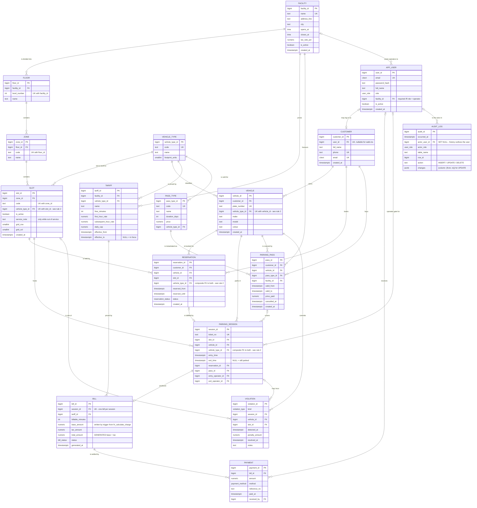
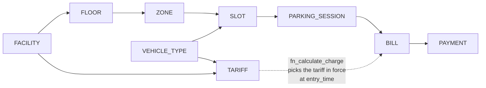
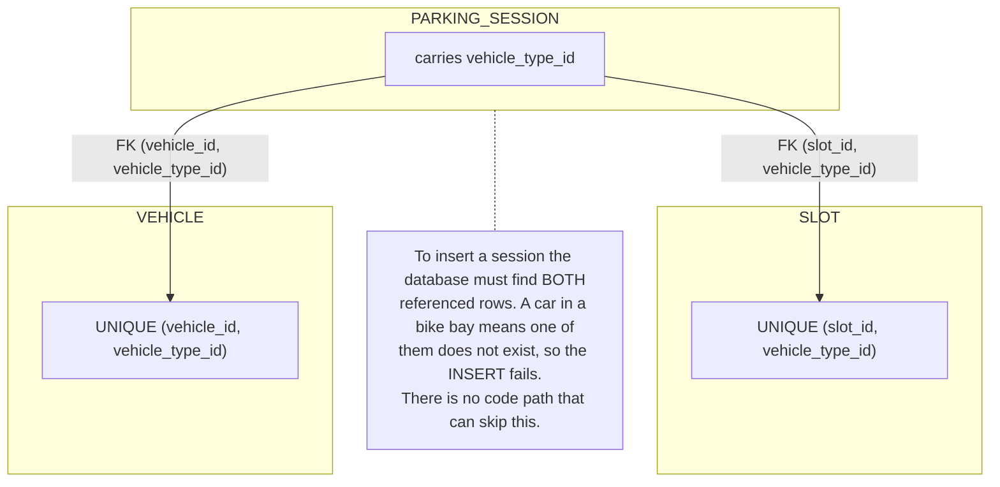

# Entity–Relationship Diagram

Smart Parking Lot Allocation & Billing System — DBMS PBL Project 20.

This diagram is drawn from the live schema in `db/migrations/`, not from an
earlier sketch. Every relationship shown below corresponds to a real foreign
key you can list with `\d+ <table>` in `psql`.

**Reading the notation (crow's foot).** The marker at each end of a line says
how many rows at *that* end relate to one row at the other end:

| Marker | Meaning | In this schema |
|---|---|---|
| `\|\|` | exactly one | the foreign key is `NOT NULL` |
| `\|o` / `o\|` | zero or one | the foreign key is nullable, or `UNIQUE` on the child side |
| `o{` | zero or many | an ordinary one-to-many |

For example `APP_USER |o--o| CUSTOMER`: a customer has at most one login
(`customer.user_id` is nullable and `UNIQUE`, since walk-in customers have none),
and a login belongs to at most one customer.

---

## 1. Full model

`AUDIT_LOG` has no foreign key to the rows it describes: it records ten
different tables (`table_name`, `row_id`), and its entries must survive the
deletion of the row they describe. It is written only by the `trg_audit`
trigger and readable only by administrators.

---

## 2. The structural spine

The physical hierarchy is a strict containment chain. Every slot resolves to
exactly one facility by walking it, which is why `tariff` is keyed on
`facility_id` rather than duplicated onto each bay.

---

## 3. How the slot / vehicle-type match is enforced

This is the part worth explaining in a viva. Business rule 2 is not a trigger
and not application code — it is three constraints that make the invalid state
unrepresentable.

Because `parking_session.vehicle_type_id` is pinned simultaneously to the
slot's type and the vehicle's type, the two are forced equal. `reservation`
carries `vehicle_type_id` and the same pair of composite keys, so a booking
for the wrong kind of bay is refused at booking time too (TESTING.md test 18). Lying about the
type in either direction fails — proven in `docs/TESTING.md`, tests 3 and 3b.

---

## 4. Cardinality summary

| Relationship | Cardinality | Enforced by |
|---|---|---|
| facility → floor | 1 : N | `fk_floor_facility`, ON DELETE CASCADE |
| floor → zone | 1 : N | `fk_zone_floor`, ON DELETE CASCADE |
| zone → slot | 1 : N | `fk_slot_zone`, ON DELETE CASCADE |
| customer → vehicle | 1 : N | `fk_vehicle_customer`, ON DELETE RESTRICT |
| vehicle → parking_session | 1 : N over time, **1 : 1 at any instant** | `uq_active_session_vehicle` (partial unique) |
| slot → parking_session | 1 : N over time, **1 : 1 at any instant** | `uq_active_session_slot` (partial unique) |
| slot → reservation | 1 : N, **non-overlapping while live** | `ex_reservation_no_overlap` (GiST exclusion) |
| parking_session → bill | 1 : 0..1 | `bill.session_id` UNIQUE |
| bill → payment | 1 : N | `fk_payment_bill`, ON DELETE CASCADE |
| reservation → parking_session | 1 : 0..1 | `parking_session.reservation_id` UNIQUE |
| app_user → customer | 1 : 0..1 | `customer.user_id` UNIQUE, nullable |
| facility + vehicle_type → tariff | 1 : N, **one in force at a time** | `ex_tariff_no_overlap` (GiST exclusion) |
| vehicle + facility → parking_pass | 1 : N, **one live at a time** | `ex_pass_no_overlap` (GiST exclusion) |
| customer → reservation / pass, **own vehicles only** | 1 : N | `fk_reservation_vehicle_owner`, `fk_pass_vehicle_owner` — composite FK onto `vehicle (vehicle_id, customer_id)` |
| app_user → audit_log | 1 : N | `audit_log.actor_user_id`, ON DELETE SET NULL |

---

## 5. Deliberate absences

Three attributes a first draft would include are **not** in this model, and
their absence is the design:

| Not stored | Why | Derived instead by |
|---|---|---|
| `slot.status` (free/occupied) | Two places to update on every gate event, with nothing forcing them to agree | `v_current_occupancy` |
| `parking_session.status` (active/completed) | Derivable from `exit_time IS NULL`; storing it permits a row that claims 'active' while carrying an exit time | the `exit_time` predicate |
| `parking_pass.status` (active/expired) | Derivable from the date window; storing it needs a nightly job to stay honest | `v_pass_usage` |

Full reasoning in [NORMALIZATION.md](NORMALIZATION.md) §4.
