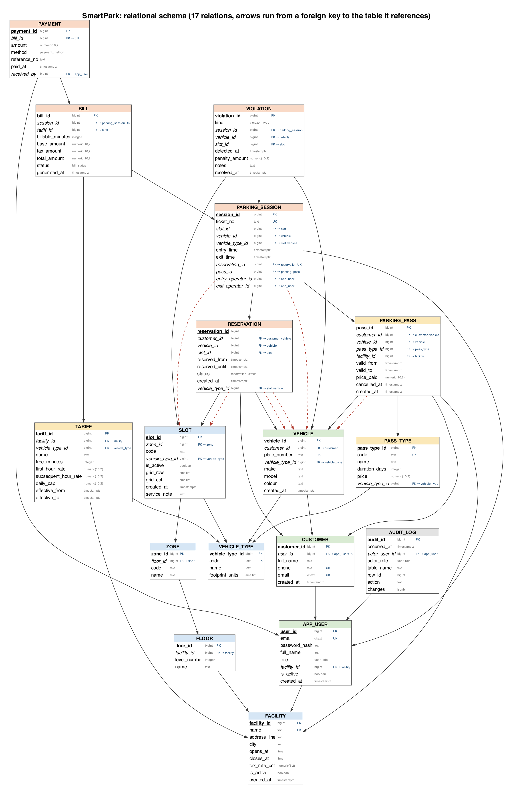

# Relational Schema

Smart Parking Lot Allocation & Billing System: DBMS PBL Project 20.

Generated from the live PostgreSQL catalogue by `tests/gen_schema_docs.py`, so it describes the implemented database exactly. The same schema in executable form is [`db/schema_snapshot.sql`](../../db/schema_snapshot.sql); the migrations in [`db/migrations/`](../../db/migrations/) are the source of truth.

## 1. How to read it

| Marking | Meaning |
|---|---|
| <ins>**underlined bold**</ins> | primary key |
| *italic* | foreign key (the table it points to is listed in section 3) |
| UK | UNIQUE column (a candidate key) |

## 2. The 17 relations

**APP_USER** ( <ins>**user_id**</ins>, email&nbsp;UK, password_hash, full_name, role, *facility_id*, is_active, created_at )

**AUDIT_LOG** ( <ins>**audit_id**</ins>, occurred_at, *actor_user_id*, actor_role, table_name, row_id, action, changes )

**BILL** ( <ins>**bill_id**</ins>, *session_id*&nbsp;UK, *tariff_id*, billable_minutes, base_amount, tax_amount, total_amount, status, generated_at )

**CUSTOMER** ( <ins>**customer_id**</ins>, *user_id*&nbsp;UK, full_name, phone&nbsp;UK, email&nbsp;UK, created_at )

**FACILITY** ( <ins>**facility_id**</ins>, name&nbsp;UK, address_line, city, opens_at, closes_at, tax_rate_pct, is_active, created_at )

**FLOOR** ( <ins>**floor_id**</ins>, *facility_id*, level_number, name )

**PARKING_PASS** ( <ins>**pass_id**</ins>, *customer_id*, *vehicle_id*, *pass_type_id*, *facility_id*, valid_from, valid_to, price_paid, cancelled_at, created_at )

**PARKING_SESSION** ( <ins>**session_id**</ins>, ticket_no&nbsp;UK, *slot_id*, *vehicle_id*, *vehicle_type_id*, entry_time, exit_time, *reservation_id*&nbsp;UK, *pass_id*, *entry_operator_id*, *exit_operator_id* )

**PASS_TYPE** ( <ins>**pass_type_id**</ins>, code&nbsp;UK, name, duration_days, price, *vehicle_type_id* )

**PAYMENT** ( <ins>**payment_id**</ins>, *bill_id*, amount, method, reference_no, paid_at, *received_by* )

**RESERVATION** ( <ins>**reservation_id**</ins>, *customer_id*, *vehicle_id*, *slot_id*, reserved_from, reserved_until, status, created_at, *vehicle_type_id* )

**SLOT** ( <ins>**slot_id**</ins>, *zone_id*, code, *vehicle_type_id*, is_active, grid_row, grid_col, created_at, service_note )

**TARIFF** ( <ins>**tariff_id**</ins>, *facility_id*, *vehicle_type_id*, name, free_minutes, first_hour_rate, subsequent_hour_rate, daily_cap, effective_from, effective_to )

**VEHICLE** ( <ins>**vehicle_id**</ins>, *customer_id*, plate_number&nbsp;UK, *vehicle_type_id*, make, model, colour, created_at )

**VEHICLE_TYPE** ( <ins>**vehicle_type_id**</ins>, code&nbsp;UK, name, footprint_units )

**VIOLATION** ( <ins>**violation_id**</ins>, kind, *session_id*, *vehicle_id*, *slot_id*, detected_at, penalty_amount, notes, resolved_at )

**ZONE** ( <ins>**zone_id**</ins>, *floor_id*, code, name )

*Each box is a relation; each arrow runs from a foreign key to the primary key it references. Dashed red arrows are composite foreign keys, which make the database refuse a car in a bike bay and a booking on someone else's vehicle. [SVG version](er/relational_schema.svg) for zooming.*

## 3. Foreign keys

| # | Child table | Foreign key | Parent table | Parent key | Required? | ON DELETE |
|--:|---|---|---|---|---|---|
| 1 | `app_user` | `facility_id` | `facility` | `facility_id` | no (nullable) | RESTRICT |
| 2 | `audit_log` | `actor_user_id` | `app_user` | `user_id` | no (nullable) | SET NULL |
| 3 | `bill` | `session_id` | `parking_session` | `session_id` | yes | CASCADE |
| 4 | `bill` | `tariff_id` | `tariff` | `tariff_id` | yes | RESTRICT |
| 5 | `customer` | `user_id` | `app_user` | `user_id` | no (nullable) | SET NULL |
| 6 | `floor` | `facility_id` | `facility` | `facility_id` | yes | CASCADE |
| 7 | `parking_pass` | `customer_id` | `customer` | `customer_id` | yes | RESTRICT |
| 8 | `parking_pass` | `facility_id` | `facility` | `facility_id` | yes | CASCADE |
| 9 | `parking_pass` | `pass_type_id` | `pass_type` | `pass_type_id` | yes | RESTRICT |
| 10 | `parking_pass` | `vehicle_id` | `vehicle` | `vehicle_id` | yes | RESTRICT |
| 11 | `parking_pass` | `vehicle_id, customer_id` | `vehicle` | `vehicle_id, customer_id` | yes | NO ACTION |
| 12 | `parking_session` | `entry_operator_id` | `app_user` | `user_id` | no (nullable) | SET NULL |
| 13 | `parking_session` | `exit_operator_id` | `app_user` | `user_id` | no (nullable) | SET NULL |
| 14 | `parking_session` | `pass_id` | `parking_pass` | `pass_id` | no (nullable) | SET NULL |
| 15 | `parking_session` | `reservation_id` | `reservation` | `reservation_id` | no (nullable) | SET NULL |
| 16 | `parking_session` | `slot_id, vehicle_type_id` | `slot` | `slot_id, vehicle_type_id` | yes | RESTRICT |
| 17 | `parking_session` | `vehicle_id, vehicle_type_id` | `vehicle` | `vehicle_id, vehicle_type_id` | yes | RESTRICT |
| 18 | `pass_type` | `vehicle_type_id` | `vehicle_type` | `vehicle_type_id` | yes | RESTRICT |
| 19 | `payment` | `bill_id` | `bill` | `bill_id` | yes | CASCADE |
| 20 | `payment` | `received_by` | `app_user` | `user_id` | no (nullable) | SET NULL |
| 21 | `reservation` | `customer_id` | `customer` | `customer_id` | yes | RESTRICT |
| 22 | `reservation` | `slot_id` | `slot` | `slot_id` | yes | RESTRICT |
| 23 | `reservation` | `slot_id, vehicle_type_id` | `slot` | `slot_id, vehicle_type_id` | yes | NO ACTION |
| 24 | `reservation` | `vehicle_id` | `vehicle` | `vehicle_id` | yes | RESTRICT |
| 25 | `reservation` | `vehicle_id, customer_id` | `vehicle` | `vehicle_id, customer_id` | yes | NO ACTION |
| 26 | `reservation` | `vehicle_id, vehicle_type_id` | `vehicle` | `vehicle_id, vehicle_type_id` | yes | NO ACTION |
| 27 | `slot` | `vehicle_type_id` | `vehicle_type` | `vehicle_type_id` | yes | RESTRICT |
| 28 | `slot` | `zone_id` | `zone` | `zone_id` | yes | CASCADE |
| 29 | `tariff` | `facility_id` | `facility` | `facility_id` | yes | CASCADE |
| 30 | `tariff` | `vehicle_type_id` | `vehicle_type` | `vehicle_type_id` | yes | RESTRICT |
| 31 | `vehicle` | `customer_id` | `customer` | `customer_id` | yes | RESTRICT |
| 32 | `vehicle` | `vehicle_type_id` | `vehicle_type` | `vehicle_type_id` | yes | RESTRICT |
| 33 | `violation` | `session_id` | `parking_session` | `session_id` | no (nullable) | SET NULL |
| 34 | `violation` | `slot_id` | `slot` | `slot_id` | no (nullable) | SET NULL |
| 35 | `violation` | `vehicle_id` | `vehicle` | `vehicle_id` | yes | RESTRICT |
| 36 | `zone` | `floor_id` | `floor` | `floor_id` | yes | CASCADE |

`RESTRICT` and `NO ACTION` refuse to delete a parent that still has children; `CASCADE` deletes the children with it; `SET NULL` keeps them and clears the link. Each choice is explained in the comments of `db/migrations/002` to `004`.

## 4. Candidate keys (UNIQUE constraints)

| Table | Primary key | Other unique keys |
|---|---|---|
| `app_user` | `user_id` | `email` |
| `audit_log` | `audit_id` | none |
| `bill` | `bill_id` | `session_id` |
| `customer` | `customer_id` | `email`, `phone`, `user_id` |
| `facility` | `facility_id` | `name` |
| `floor` | `floor_id` | `(facility_id, level_number)` |
| `parking_pass` | `pass_id` | none |
| `parking_session` | `session_id` | `reservation_id`, `ticket_no` |
| `pass_type` | `pass_type_id` | `code` |
| `payment` | `payment_id` | none |
| `reservation` | `reservation_id` | none |
| `slot` | `slot_id` | `(slot_id, vehicle_type_id)`, `(zone_id, code)` |
| `tariff` | `tariff_id` | none |
| `vehicle` | `vehicle_id` | `(vehicle_id, customer_id)`, `(vehicle_id, vehicle_type_id)`, `plate_number` |
| `vehicle_type` | `vehicle_type_id` | `code` |
| `violation` | `violation_id` | none |
| `zone` | `zone_id` | `(floor_id, code)` |

The composite unique keys such as `(slot_id, vehicle_type_id)` exist so that other tables can point at them with composite foreign keys.

## 5. Order the tables must be created in

A table can only be created after every table its foreign keys point to. That gives these levels (the migrations follow this order):

| Level | Tables |
|--:|---|
| 1 | `facility`, `vehicle_type` |
| 2 | `app_user`, `floor`, `pass_type`, `tariff` |
| 3 | `audit_log`, `customer`, `zone` |
| 4 | `slot`, `vehicle` |
| 5 | `parking_pass`, `reservation` |
| 6 | `parking_session` |
| 7 | `bill`, `violation` |
| 8 | `payment` |

## 6. See also

- [ER_DIAGRAM.md](ER_DIAGRAM.md): the entity-relationship diagrams, in Chen notation with a legend
- [NORMALIZATION.md](NORMALIZATION.md): functional dependencies and the 1NF to 3NF derivation
- [DATA_DICTIONARY.md](DATA_DICTIONARY.md): every column, type and constraint
